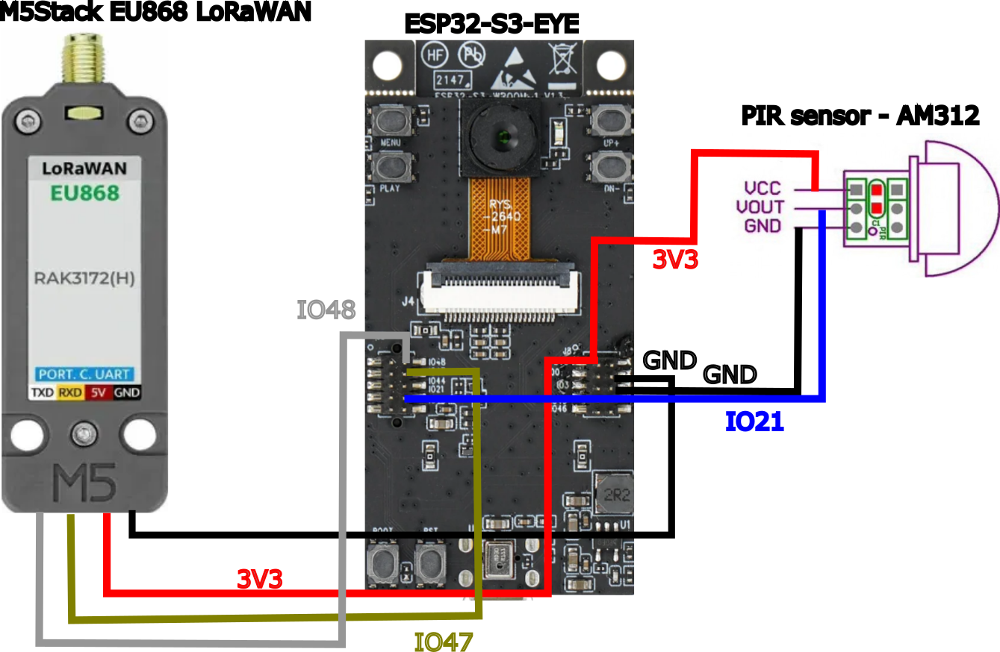
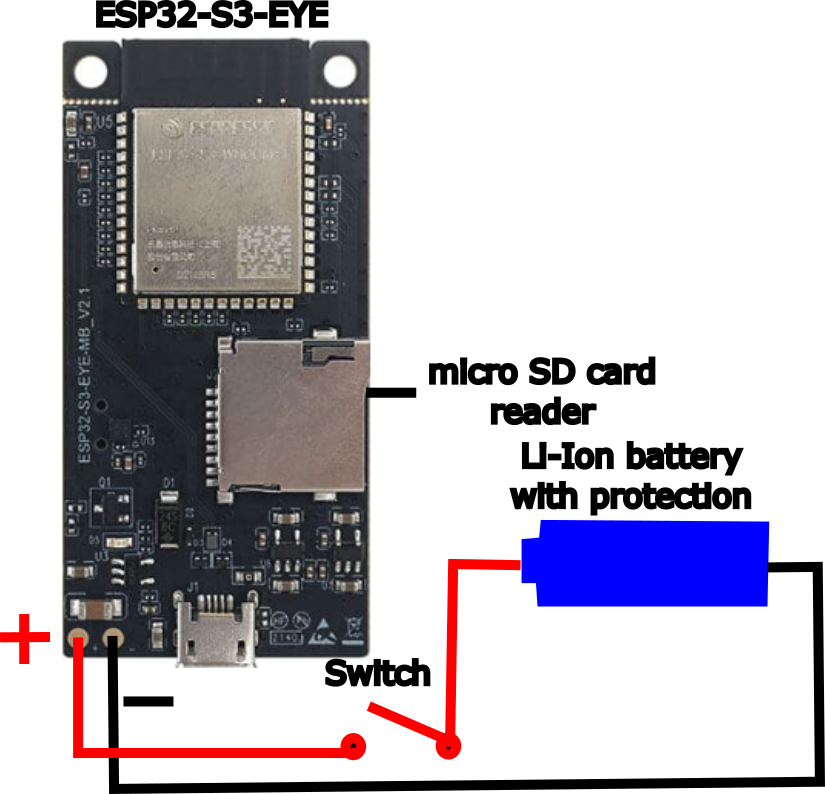
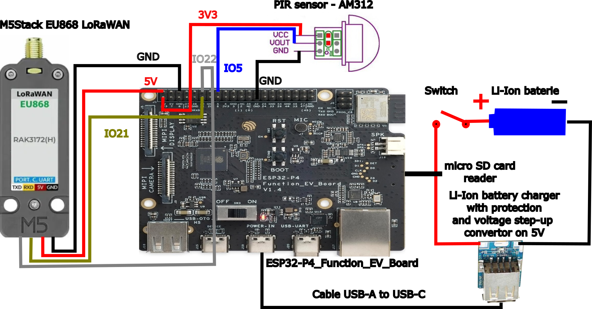

# ESP32 Camera Trap – Wildlife Detection using Edge Impulse (FOMO)

This project is a **camera trap** built on the **ESP32-S3** platform (or experimentally ESP32-P4) that uses an **Edge Impulse-trained neural network** to detect wildlife (e.g., deer, wild boars) and sends occurrences to **The Things Network (TTN)** via **LoRaWAN** using an **M5Stack LoRaWAN Module (EU868)**. For receiving the data, you can use application in [this](https://github.com/vondryas/Wild-animal-detector-data-receiver) repository.

After successful detection will wail 1 minute before it can detect again. This is to prevent too many multiple detections of the same animal in a short time. Sending images and storing images on the SD card will be executed at the same time. Device try to connect to TTN for 70 seconds. After that it will stop and go to sleep. To succesfully send the data you must be in range of gateway. Tested on 1.5 km with SenseCap M2 LoRaWAN gateway and M5Stack lorawan module.

S3


P4


---

## Software Requirements
Tested on Windows 11

- **ESP-IDF** (v5.4 or later)
- **VS Code** (optional, but recommended)
- **ESP-IDF Extension for VS Code** (optional, but recommended)
- [TTN Console](https://console.thethingsnetwork.org/) account

---

## Hardware Requirements

- **ESP32-S3-EYE or ESP32-P4_Function_EV_Board v1.4** (P4 version is partially non-functional, see notes below)
- **Camera OV2640** (ESP32-S3) or **SC2336** (ESP32-P4, via MIPI)
- **M5Stack LoRaWAN Module (EU868)**
- Battery power supply (3.7V lithium battery) an power switch. For S3 battery must have protection circuit. For P4 you must use external Li-Ion battery charger with protection circuit and step-up converter to 5V and cable USB-A to USB-C.
- PIR sensor (AM312)
- uSD card (optional, for saving images)


---

## Wiring Overview

ESP32-S3-EYE (OV2640) + M5Stack LoRaWAN Module (EU868) + PIR Sensor


ESP32-P4_Function_EV_Board v1.4 (SC2336) + M5Stack LoRaWAN Module (EU868) + PIR Sensor


---

## Edge Impulse Model

- The model is trained and exported using **Edge Impulse** in universal c++ library
- Used via the `edge-impulse-sdk` in this project
- This project is written from their standalone application

---

## TTN add end device to application

1. Log in to [TTN Console](https://console.thethingsnetwork.org/)
2. Create a new **application**
3. Register a new end device in the application 
4. Enter end device specifics manually
5. Frequency plan: Europe 863-870 MHz (SF9 for RX2 - recommended)
6. LoRaWAN Specification 1.0.3
7. Enter JoinEUI for example 0000000000000000
8. Generate DevEUI and AppKey.
9. Enter device ID
10. Register end device 

---

## Setup LoRaWAN in sdkconfig for ESP-IDF
1. Use `idf.py menuconfig` to open the configuration menu or in VS Code use `ESP-IDF: Open SDK Configuration Editor`
2. Configure the LoRaWAN Configuration based on end device settings in TTN JoinEUI is the same as AppEUI

---

## Building and Flashing

All tested on Windows 11

```bash
idf.py set-target esp32s3        # or esp32p4
idf.py menuconfig # set up LoRaWAN settings
idf.py build
idf.py -p COM12 flash monitor
```

COM port depends on your system. Replace `COM12` with the correct port for your device.

In VS Code:
- Select the target chip
- select the port
- SDK Configuration for LoRaWAN
- build, flash and monitor

---

## ESP32-P4 Limitations

- ESP32-P4 is **not supported by `esp_camera`**
- The SC2336 camera via MIPI is **not yet supported** by `esp_camera` 
- Camera support is being tested using [`esp-video`](https://github.com/espressif/esp-video) and the `who_cam` component, but it's not stable yet
- ESP_video has problem with using SD card in ESP-BSP library.
- SC2336 has problem with capturing images outside. Different camera is recommended

---

## Libraries and Dependencies

- `esp-idf` (version 5.4)
- `esp_camera` (for S3 and OV2640 only)
- `edge-impulse-sdk`
- `esp-bsp` (name of bsp library is based on name of board)
- **M5Stack LoRaWAN module library** (Arduino-based, integrated manually)
- For ESP32-P4:
  - `esp-video` (for SC2336 camera)
  - `who_cam` (for SC2336 camera) component from ESP WHO

---
